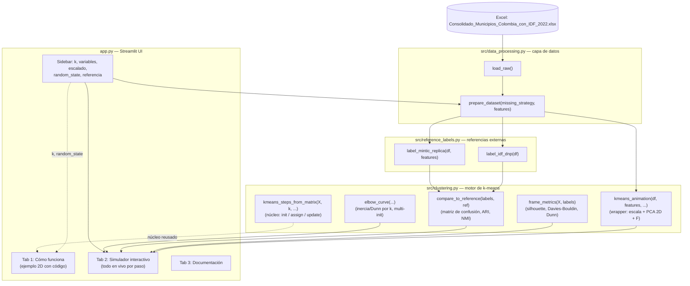

# Arquitectura de la aplicación

Documento técnico del **Simulador K-Means — Municipios de Colombia**: cómo
está organizado el código, qué hace cada módulo, qué dependencias usa, dónde
está desplegado, y el historial de prompts que guiaron su construcción con
asistencia de IA.

Para la metodología y los resultados del análisis, ver [INFORME.md](INFORME.md).
Para instrucciones de uso, ver [README.md](README.md).

---

## 1. Visión general

La aplicación es un **monolito Streamlit** (un solo proceso Python que sirve
tanto la lógica como la interfaz web, sin backend/frontend separados). Se
organiza en tres capas:

1. **Datos** (`src/data_processing.py`): carga y limpia el Excel fuente.
2. **Motor de clustering** (`src/clustering.py`): k-medias implementado a
   mano paso a paso, métricas de calidad, comparación contra referencias.
3. **UI / orquestación** (`app.py`): controles, pestañas, gráficas — llama a
   las dos capas anteriores y renderiza el resultado con Streamlit.

No hay base de datos ni API: el dataset es un archivo Excel versionado en el
propio repositorio (`data/`), y el "estado" de la sesión (paso actual de la
animación, configuración vigente) vive en `st.session_state`, en memoria del
proceso de Streamlit.

## 2. Diagrama de arquitectura



**Cómo leerlo:** el Excel se carga una sola vez (`load_raw`, cacheado); cada
cambio en la barra lateral pasa por `prepare_dataset` para filtrar/imputar
filas y vuelve a alimentar tanto el motor de clustering como los esquemas de
referencia. `kmeans_steps_from_matrix` es el núcleo puro (opera sobre una
matriz numpy) que reutilizan **tanto** el ejemplo sencillo en 2D (Tab 1)
**como** `kmeans_animation` (que además estandariza y proyecta a 2D con PCA
para el caso real de 5 variables, Tab 2) — es el mismo algoritmo en los dos
sitios, solo cambian los datos de entrada.

## 3. Estructura del repositorio

```
kmeans_app/
├── app.py                    # UI Streamlit: sidebar + 3 pestañas (656 líneas)
├── src/
│   ├── data_processing.py    # Carga/limpieza del Excel (69 líneas)
│   ├── clustering.py         # K-means manual, métricas, comparación (264 líneas)
│   └── reference_labels.py   # Esquemas de clasificación de referencia (56 líneas)
├── data/
│   └── Consolidado_Municipios_Colombia_con_IDF_2022.xlsx
├── requirements.txt
├── .streamlit/config.toml    # Tema visual
├── README.md                 # Uso y despliegue
├── INFORME.md                # Metodología y resultados del análisis
└── ARQUITECTURA.md           # Este documento
```

### 3.1 `src/data_processing.py`
- `load_raw()` — lee la hoja `Consolidado 2025-2026` del Excel, renombra
  columnas a nombres cortos internos, convierte a numérico. Cacheado con
  `@st.cache_data` (se lee del disco una sola vez por sesión).
- `prepare_dataset(missing_strategy, features)` — aplica la estrategia de
  datos faltantes (excluir filas o imputar con la mediana) y devuelve el
  dataframe listo para clustering + metadatos (`n_total`, `n_missing`, `n_usado`).
- Constantes: `FEATURE_LABELS` (nombre técnico → nombre legible),
  `DEFAULT_FEATURES` (las 5 variables usadas por defecto).

### 3.2 `src/clustering.py`
- `kmeans_steps_from_matrix(X, k, random_state, max_iter, project)` — **el
  algoritmo en sí**, escrito a mano (no `sklearn.cluster.KMeans.fit`):
  inicializa k centroides al azar, alterna asignación (distancia euclidiana,
  `scipy.spatial.distance.cdist`) y actualización (promedio por grupo),
  hasta que ninguna etiqueta cambia. Devuelve una lista de `StepFrame`
  (un fotograma por paso: tipo, iteración, etiquetas, centroides, inercia,
  cuántos puntos cambiaron).
- `kmeans_animation(df, features, k, scale, ...)` — wrapper para datos reales
  de n variables: estandariza (`StandardScaler`) si corresponde, ajusta un
  PCA a 2 componentes para poder graficar, y delega el núcleo del algoritmo
  a `kmeans_steps_from_matrix`.
- `frame_metrics(X, labels)` — silhouette, Calinski-Harabasz, Davies-Bouldin
  e Índice de Dunn (implementación propia) para *cualquier* paso intermedio,
  no solo el resultado final.
- `elbow_curve(...)` — corre `sklearn.cluster.KMeans` con reinicios múltiples
  (`n_init`) para un rango de k, para el análisis agregado de "¿cuántos
  clusters uso?" (independiente de la animación paso a paso).
- `align_clusters_to_labels` / `compare_to_reference` — empareja cada
  cluster (número sin significado propio) con la categoría de referencia más
  frecuente en su interior (algoritmo húngaro, `scipy.optimize.linear_sum_assignment`),
  y calcula matriz de confusión, accuracy, ARI, NMI y precisión/recall/F1.

### 3.3 `src/reference_labels.py`
- `label_idf_dnp(df)` — clasifica cada municipio según los rangos oficiales
  del DNP para el Índice de Desempeño Fiscal.
- `label_mintic_replica(df, features)` — aproximación por cuantiles de un
  score compuesto, para reproducir los tamaños de grupo del estudio MinTIC
  2023 (124/416/561 de 1.101).

### 3.4 `app.py`
Orquesta todo: define los controles de la barra lateral (variables, manejo
de datos faltantes, escalado, k, `random_state`, esquema de referencia) y
tres pestañas:

| Pestaña | Contenido | Depende de |
|---|---|---|
| 🧩 Cómo funciona | Ejemplo mínimo (24 puntos 2D) con el código real de cada paso, usando el `k`/`random_state` de la barra lateral | `kmeans_steps_from_matrix` |
| 🎓 Simulador interactivo | Animación paso a paso con los 1.101 municipios; para el paso actual recalcula en vivo: gráfica PCA, métricas de calidad, perfil de clusters, matriz de confusión | `kmeans_animation`, `frame_metrics`, `compare_to_reference`, `elbow_curve` |
| 📚 Documentación | Explicación de la metodología, variables y métricas | — |

El estado de "en qué paso de la animación estoy" (`st.session_state.frame_idx`,
`toy_step`) se resetea automáticamente cuando cambia la configuración
relevante (k, variables, escalado, `random_state`), comparando un
"fingerprint" de la config en cada rerun.

## 4. Flujo de ejecución típico

1. El usuario cambia un control en la barra lateral (p. ej. `k`).
2. Streamlit vuelve a ejecutar `app.py` de arriba a abajo (modelo de
   ejecución de Streamlit: cada interacción reejecuta el script completo).
3. `prepare_dataset` se recalcula (cacheado por `@st.cache_data`, así que si
   `missing_strategy`+`features` no cambiaron, se reusa el resultado).
4. `kmeans_animation` (o `kmeans_steps_from_matrix` en la pestaña 1) genera
   la lista completa de pasos para la nueva configuración (también cacheado).
5. Como cambió el "fingerprint" de configuración, el paso actual se reinicia
   a 0.
6. Se renderiza el paso actual: gráfica (Plotly), métricas (`frame_metrics`),
   perfil de clusters (pandas `groupby`), matriz de confusión
   (`compare_to_reference`).
7. Al presionar "▶️ Reproducir", un bucle de Python recorre los pasos
   restantes actualizando placeholders de Streamlit (`st.empty()`) con una
   pequeña pausa (`time.sleep`) entre cada uno, dentro de la misma ejecución.

## 5. Dependencias

| Paquete | Versión mínima | Uso en esta app |
|---|---|---|
| [`streamlit`](https://streamlit.io/) | 1.38 | Framework de la interfaz web (sidebar, pestañas, widgets, `st.cache_data`, `st.session_state`) |
| [`pandas`](https://pandas.pydata.org/) | 2.2 | Carga y manipulación del dataset (Excel → DataFrame, `groupby`, filtros) |
| [`numpy`](https://numpy.org/) | 1.26 | Álgebra vectorial: distancias, promedios, generación de números aleatorios (`RandomState`) |
| [`scikit-learn`](https://scikit-learn.org/) | 1.4 | `StandardScaler`, `PCA`, `KMeans` (solo para la curva del codo con reinicios múltiples) y las métricas `silhouette_score`, `calinski_harabasz_score`, `davies_bouldin_score`, `adjusted_rand_score`, `normalized_mutual_info_score`, `confusion_matrix`, y `make_blobs` (dataset de juguete del Tab 1) |
| [`scipy`](https://scipy.org/) | 1.12 | `cdist` (distancias euclidianas por lotes, corazón del algoritmo) y `linear_sum_assignment` (algoritmo húngaro para emparejar clusters con categorías) |
| [`plotly`](https://plotly.com/python/) | 5.22 | Todas las gráficas interactivas (dispersión, líneas, heatmap, barras) |
| [`openpyxl`](https://openpyxl.readthedocs.io/) | 3.1 | Motor que usa pandas para leer el archivo `.xlsx` |

No hay dependencias de infraestructura (sin Docker, sin base de datos, sin
servicios externos en tiempo de ejecución) — es una app Python autocontenida.

## 6. Despliegue

| Elemento | Detalle |
|---|---|
| **Código fuente** | [github.com/daesbello/kmeans-municipios-colombia](https://github.com/daesbello/kmeans-municipios-colombia) (rama `main`) |
| **Aplicación en producción** | [kmeans-municipios-colombia.streamlit.app](https://kmeans-municipios-colombia.streamlit.app/) |
| **Plataforma** | Streamlit Community Cloud (gratuita) |
| **Mecanismo de despliegue** | Streamlit Cloud está conectado directamente al repositorio de GitHub; cada `git push` a `main` dispara un redespliegue automático (build + reinstalación de `requirements.txt` + reinicio del proceso) |
| **Punto de entrada** | `app.py` (raíz del repositorio) |

**Nota sobre Hugging Face Spaces:** el repositorio incluye en `README.md` el
bloque de metadatos YAML que exige Hugging Face Spaces (`sdk: streamlit`,
`app_file: app.py`, etc.) por si se quiere desplegar ahí en el futuro, pero
**no se usó como plataforma final**: al momento de construir esta app,
Hugging Face Spaces requería una suscripción paga para correr Spaces con
SDK Gradio/Docker (solo el SDK "Static", sin backend Python, es gratuito),
por lo que se optó por Streamlit Community Cloud, que sí permite apps
Python gratis para repos públicos.

## 7. Proceso de desarrollo asistido por IA

Esta aplicación se construyó de forma iterativa con **Claude Code**
(Anthropic), usando el modelo **Claude Sonnet 5**, a partir de una serie de
instrucciones en lenguaje natural. A continuación, el historial de prompts
dados por el autor (transcritos tal como se escribieron, incluyendo errores
de tipeo) y qué se construyó en cada uno:

| # | Fecha | Prompt (tal cual se escribió) | Resultado |
|---|---|---|---|
| 1 | 2026-09-21 | *"toca implementar el kmeans con el dataset de la salida y a partir del pdf de la entrada entinces la idea es hacer una aplicacion que esté en python y que tenga frontend para poder ver todo el poder del kmeans, que tenga documetnacion esta aplicacion de como funciona y que sea estilo simulador y que permita ver matriz de confusion y metricas veme preguntando para que quede perfecta la app"* | Análisis del dataset y del PDF de metodología (MinTIC 2023); construcción de la primera versión de la app en Streamlit: carga de datos, k-means, curva del codo, matriz de confusión contra dos esquemas de referencia, documentación integrada |
| 2 | 2026-09-21 | *"hay algun mpc para dejar lista para publicarla en gutbhub y en esos serviciso e punlvacion gratis, galta tambien poneerme mis datos"* | Creación y push del repositorio en GitHub (`gh` CLI); ajuste de README con datos de autoría |
| 3 | 2026-09-22 | *"conevtemos"* | Conexión con Hugging Face (se descartó por requerir plan pago) y despliegue en Streamlit Community Cloud |
| 4 | 2026-09-22 | *"quiero hacerle una mejora tecnologica al app y es que se pueda ir moviendo y simulando con algun boton o escenarios y que exploque que esta pasando tecnicamente como si eso fuera un aula de clase interactiva"* | Pestaña "Aula interactiva": k-means paso a paso con controles de reproducir/pausar/avanzar |
| 5 | 2026-09-22 | *"quisiera que unificaramos matriz de vonfusion metricas simulador y aula interactiva en uno solo de tal manera que se pueda ver todo integral a medida que se vagya ejecutando la simulacion"* | Unificación de las tres pestañas en una sola vista reactiva por paso |
| 6 | 2026-09-22 | *"metamosle un modulo antes de msimulador que explica graficamente como funciona kmanes sencillito pero que se entienda en codigo y graficamente que pasa"* | Pestaña "Cómo funciona": ejemplo mínimo en 2D con código y gráfica lado a lado |
| 7 | 2026-09-22 | *"la idea es que el como funciona se aritcule con la config de la izquierda tambien enronces si algo cambia cambia aca"* | Conexión del ejemplo sencillo con `k` y `random_state` de la barra lateral |
| 8 | 2026-09-22 | *"incluyeme en el repo un readme de arqutiectura de toda la aplicacaion de depndeicas que se uso y el prompt usado todo bien docuentado a nivel arqutecutra y dodne se deplegado"* | Este documento (`ARQUITECTURA.md`) |

Además de escribir el código, en cada iteración se probó la app en un
navegador (local y/o en producción) antes de darla por terminada, revisando
logs del servidor para confirmar que no hubiera errores.

## 8. Autor

David Bello
